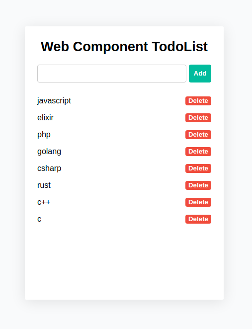

# Web component Todo List com stencil js

Projeto para exemplificar a criação de um web component com stencil.js.



## Rodar o exemplo

Primeiro instale as dependências:

```shell
npm install
```

Para iniciar o projeto basta:

```shell
npm start
```
